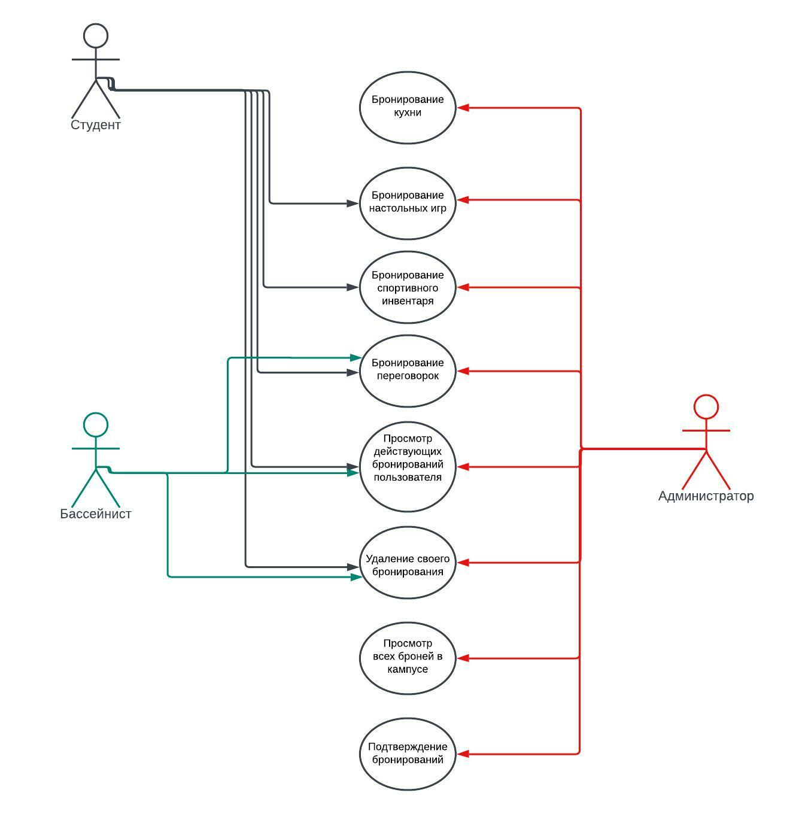
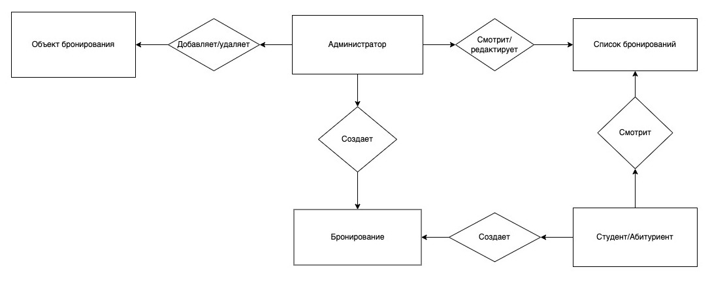
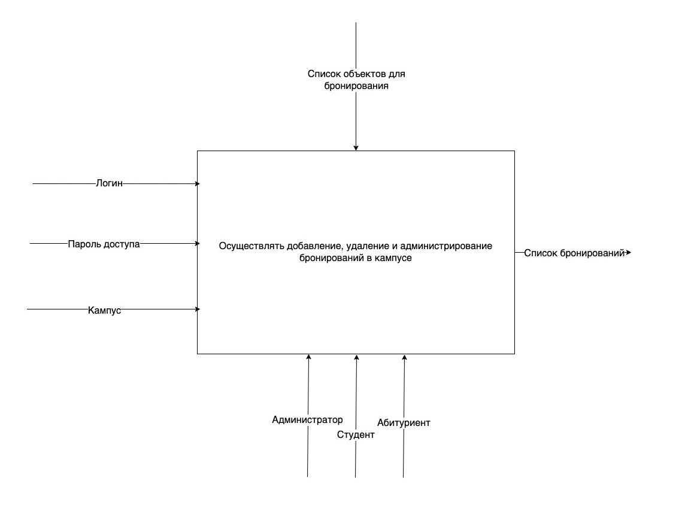
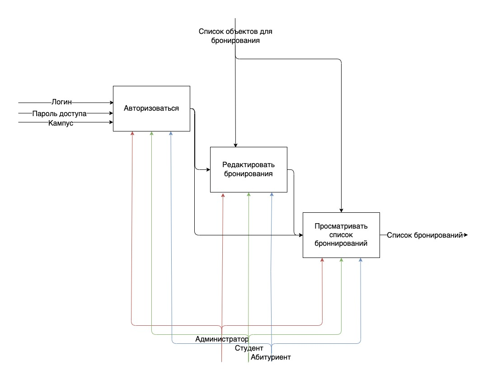
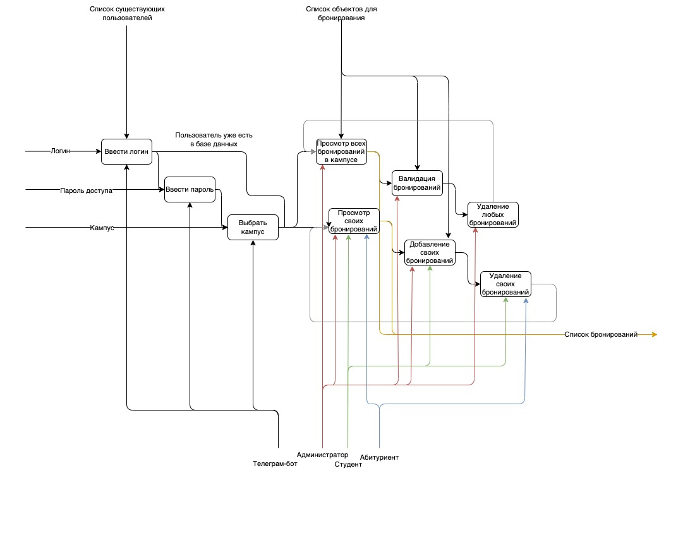
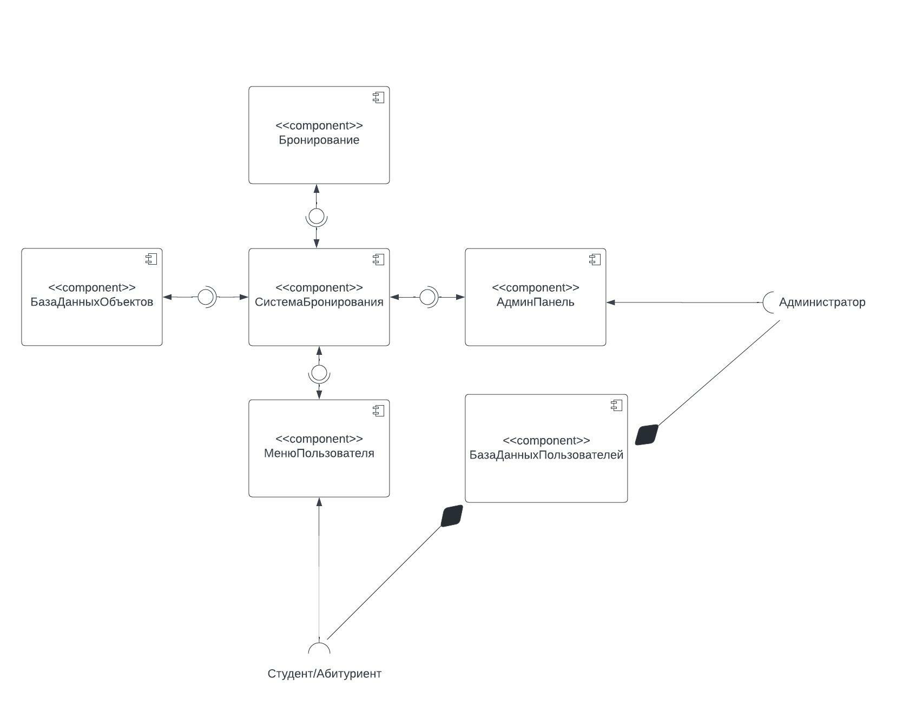
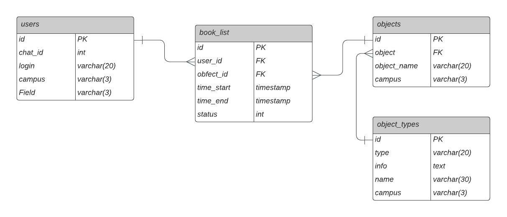

# Анализ проекта и проектирование чат-бота для бронирования вещей и помещений в Школе 21

***

## 1.1. Анализ предметной области

В школе 21 существуют локации и предметы, предназначенные для общего пользования. К ним относятся:
* Переговорки;
* Спортивный инвентарь;
* Настольные игры;
* Кухня.

Эти объекты есть в каждом из трех кампусов: московском, казанском, новосибирском.
Так как их количество ограничено, их использование возможно по предварительной брони.

Существуют определенные условия:
- количество объектов ограничено;
- бронировать нужно на определенный промежуток времени;
- некоторые объекты имеют расписание доступа к ним (например, мероприятия в конференц-залах с использованием оборудования могут проводиться только в рабочее время администрации);
- какие-то объекты доступны для бронирования только сотрудниками(кухни), какие-то сотрудниками и студентами(все остальное).

***

## 1.2. Анализ существующих решений 

В данный момент существует 2 способа осуществления бронирования.

Первый - для переговорок. На каждой из них висит qr-код со ссылкой на google-таблицу, в которую внесено расписание каждой конкретной переговорки. Механизм бронирования: сканируешь код, смотришь, когда переговорка свободна, вписываешь свой ник в ячейку таблицы, соответствующую определенной дате и времени.

Второй - для спортивного инвентаря. Запись ведется непосредственно администрацией кампуса. Механизм: подходишь в саппорт, просишь то, что тебе нужно, тебя записывают как ответственного за вещь, после использования возвращаешь.

Настольные игры находятся в свободном доступе.

Также в казанском кампусе есть книги, которые тоже можно брать по записи в google-таблицу и диски для плейстейшн, которые тоже берутся у администрации под запись.

Таблица 1 - Оценка существующих способов бронирования объектов по критериям

Существующий способ|Быстрота|Удобство|Автоматизированность|Сохранность объекта|Простота разработки|Скорость разработки
-------------------|--------|--------|--------------------|-------------------|-------------------|-------------------
Гугл-таблицы|2/3|3/3|2/3|3/3|3/3|1/3
Запись у АДМ|1/3|1/3|0/3|3/3|-|-
Свободный доступ|3/3|3/3|3/3|0/3|-|-

`Быстрота` - оценка времени, проходящего от желания забронировать объект до претворения этого в жизнь. 
`Удобство` - комфортность процесса осуществления бронирования. 
`Автоматизированность` - отсутствие необходимости привлекать к процессу бронирования большее количество лиц. 
`Сохранность объекта` - отсутствие потенциальной опасности нанесения вреда бронируемому объекту. 

***

## 1.3. Анализ способов и вариантов решения 

Таблица 1 - Оценка критериев возможных вариантов библиотек для реализации телеграм-бота на python  
Название | Ссылка на документацию | Ссылка pip | Поиск информации | Сложность разработки | Скорость разработки | Популярность
---------|------------------------|------------|------------------|----------------------|---------------------|-------------
AIOGram | https://docs.aiogram.dev/en/latest/ | https://pypi.org/project/aiogram/ | 3/3 | 3/3 | 3/3 | 3/3
Pyrogram | https://docs.pyrogram.org/ | https://pypi.org/project/Pyrogram/ | 3/3 | 2/3 | 2/3 | 3/3
pyTelegramBotAPI | https://openbase.com/python/pyTelegramBotAPI/documentation | https://pypi.org/project/pyTelegramBotAPI/ | 2/3 | 2/3 | 2/3 | 3/3
telebot | https://openbase.com/js/telebot/documentation | https://pypi.org/project/telebot/ | 3/3 | 1/3 | 3/3 | 3/3
twx.botapi | https://github.com/datamachine/twx.botapi | https://pypi.org/project/twx.botapi/ | 1/3 | 3/3 | 1/3 | 1/3

`Поиск информации` - простота нахождения информации и примеров разработки с использованием библиотеки. 
`Сложность разработки` - оценка сложности синтаксиса и работы библиотеки. 
`Скорость разработки` - оценка возможности библиотеки ускорить разработку. 
`Популярность` - популярность использования библиотеки в проектах из той же предметной области.

***

## 1.4. Формализация ролей и сценариев использования

Use-case диаграмма:

***

## 1.5. Формализация сущностей предметной области

ER-модель в нотации Чена:

***

## 1.6. Формализация постановки задачи

IDF0 диаграммы:

 

***

## 2.1. Концепция архитектуры

Наш чат-бот - это монолитное приложение. Его интерфейс должен быть реализован через взаимодействие пользователя с меню, созданное с помощью кнопок, выводящихся в сообщениях (inline buttons) и кнопок, находящиехся под окном ввода текста в диалоге с ботом (keyboard buttons).

Будет использоватьс принцип организации архитектуры проекта Clean Arhirechture, подразумевающий разделение кода на несколько файлов:
- kernel - ядро программы
- dal - функции взаимодействия с базой данных

Также будут использованы принципы REST API.

***

## 2.2. Проектирование архитектуры

Диаграмма компонентов по стандарту UML 2:

***

## 2.3. Технологический стек

Язык программирования: `python 3.X`

Библиотека для работы с чат-ботом: `pyTelegramBotAPI`

Работа с данными: `SQLite3`

***

## 2.4. Проектирование БД

ERD диаграмма по стандарту UML 2:

***

## 2.5. Организация работы

hashtagr:
* тимлид;
* системный аналитик;
* проектирование архитектуры;
* проектирование базы данных;
* бэкэнд.

karleneg:
* техлид;
* бэкенд;
* фронтенд.

***

## 2.6. Планирование

1 день: изучение методов применения используемых технологий

2 день: проектирование базы данных и написание кода взаимодействия базы данных с ботом, разработка фронтэнда

3 день: разработка фронтэнда и привязка к основному функционалу бота

4 день: тестирование, исправление багов, загрузка конечной версии на GitLab
